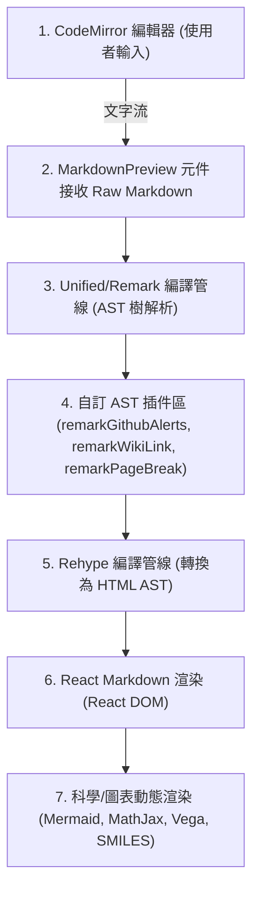

<h1 align="left">
  
  <span style="vertical-align: middle; margin-left: 10px;">Mark It Live</span>
</h1>

[](https://react.dev/)
[](https://www.typescriptlang.org/)
[](https://vite.dev/)
[](https://tailwindcss.com/)
[](LICENSE)

**專業、實時、隱私優先的 Mermaid 圖表與 Markdown 編輯器**

**Mark It Live** 是一款追求極致效能與隱私的現代化 Markdown 編輯器。所有語法解析、圖表渲染與導出運算皆在**瀏覽器客戶端**完成，實現零延遲的隨打即看體驗，並確保您的敏感文檔絕不流出本地裝置。


---

## 🌟 為什麼選擇 Mark It Live？(Core Features)

*   **⚡ 絲滑無延遲的寫作體驗**：告別傳統編輯器在處理長文檔時的輸入卡頓。無論是萬字長文還是複雜排版，都能享受毫秒級的「隨打即看」與精準的雙向同步滾動。
*   **📊 讓複雜想法一目了然**：無需跳出編輯器或繁瑣配置，原生支援全系列流程圖、甘特圖、數學公式甚至樂譜，幫助您輕鬆產出極具專業度與說服力的文檔。
*   **🔒 絕對隱私**：您的商業機密或個人筆記絕不會上傳至任何雲端伺服器。所有的編輯與運算皆在您的設備本地完成，確保 100% 的資料安全。
*   **🧰 專為生產力打造的工具箱**：Excel 資料直接貼上即轉為表格；排版完成後一鍵即可將多篇文檔合併匯出為高畫質 PDF。將瑣碎的排版工作交給我們，您只需專注於創作。

---

## ⚡ 技術架構：AST 插件化渲染管線 (Technical Highlights)

專案於 2026 年 5 月進行了重大的架構變革，徹底捨棄了傳統的「字串正則預處理」與「React Render DOM 克隆深度遍歷」解析方式，改採 **Unified / Remark 的 AST（抽象語法樹）插件驅動架構**。

### 📌 渲染管線流程圖



### 🧩 自訂 Remark 插件優勢
1.  **安全邊界 (Security Boundary)**：插件在 AST 階段進行條件式遍歷，能夠感知語義上下文，防禦性地**避開 `code` 與 `inlineCode` 節點**，100% 避免程式碼區塊內部的 WikiLink、Alerts 或分頁標記被誤殺。
2.  **極速渲染 (High Performance)**：所有解析與轉換在語法樹階段一次完成，與 UI 渲染徹底解耦，大幅降低 CPU 損耗，解決了輸入卡頓問題。
3.  **100% 測試覆蓋 (100% Test Coverage)**：所有插件的解析邏輯皆已透過單元測試進行獨立且完整的驗證，確保系統的高穩定性。

---

## 🛠️ 開發與技術交流 (Development)

我們歡迎熱愛前端技術、Markdown 解析器與 AST 語法樹的開發者共同交流。如果您希望在本地運行專案進行源碼研究或提供 PR：

### 本地開發環境
請確保您的環境安裝了 Node.js (>=22)。

```bash
# 1. 複製專案
git clone https://github.com/ian7814508123/Mark-It-Live.git

# 2. 安裝依賴
npm install

# 3. 啟動本地開發伺服器
npm run dev
```

> [!NOTE]
> 關於本專案的底層技術細節、自訂 Remark 插件開發指南，以及更深入的架構設計，請參閱我們的 `docs/` 技術文檔庫。

---

## 📂 專案結構 (Directory Structure)

專案嚴格遵守高品質的開發目錄規範：

```text
Mark-It-Live/
├── src/                    # 應用程式原始碼
│   ├── components/         # React 元件
│   │   └── markdown/       # 自訂 Remark/Rehype AST 插件與預覽元件
│   ├── styles/             # CSS 樣式系統與主題配置
│   ├── App.tsx             # 主應用程式邏輯
│   └── index.tsx           # 應用程式入口
├── tests/                  # 單元測試與集成測試目錄 (使用 Vitest)
│   └── components/         # 針對 AST 插件與元件的 100% 覆蓋測試
├── docs/                   # 專案技術文件與規範指引
│   ├── DEVELOPMENT.md      # 開發與部署完整指南
│   ├── REMARK-PLUGINS.md   # 自訂 Remark 插件維護指南
│   ├── PROJECT-INDEX.md    # 專案檔案結構與索引地圖
│   └── SEO-GUIDE.md        # 搜尋引擎優化與推廣指南
├── Dockerfile              # 生產環境 Docker 配置
├── docker-compose.yml      # Docker Compose 配置
├── nginx.conf              # 生產級 Nginx 配置
└── package.json            # 專案依賴與腳本
```

---

## 🏗️ 貢獻規範 (DoD)

為了維護專案架構的穩定性：
1.  **單元測試**：任何新開發的元件、自訂 AST 插件或重大業務邏輯在**未附帶單元測試 (Unit Test)** 前，視為「未完成」。
2.  **文件同步**：所有新增功能或架構異動在**未同步更新 README 或 `docs/` 指南**前，視為「未交付」。
3.  **代碼風格**：新撰寫的程式碼註解、工作流文件與技術文件，一律使用**繁體中文 (zh-tw)**，程式碼保持高可讀性，拒絕 Magic Numbers 與過度巢狀。

---

## ⚖️ 授權與版權 (License)

本專案的原始碼基於 [Apache License 2.0](LICENSE) 釋出，您可以自由使用、修改與分發程式碼。

> ** 品牌保留權利 (Exception)**
> 
> 以下品牌資產**不**包含在 Apache 2.0 授權範圍內，保留所有權利 (All Rights Reserved)：
> * "Mark It Live" 的名稱與商標。
> * 專案中的 Logo 圖檔與相關品牌圖標。
> 
> 如果您要 Fork 或二次開發並公開發佈本專案，請替換掉所有的品牌 Logo，請勿使用 "Mark It Live" 之名義，以避免造成使用者的混淆或暗示原作者的背書。

---

**⭐ 喜歡我們的技術架構或產品設計嗎？歡迎在 GitHub 點個 Star 進行交流！**
