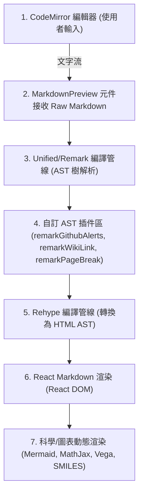

<h1 align="left">
  
  <span style="vertical-align: middle; margin-left: 10px;">Markdown Live Previewer</span>
</h1>

[](https://react.dev/)
[](https://www.typescriptlang.org/)
[](https://vite.dev/)
[](https://tailwindcss.com/)
[](https://www.docker.com/)
[](LICENSE)

**專業、實時、隱私優先的 Mermaid 圖表與 Markdown 編輯器**

Markdown Live Previewer 是一款功能強大且著重隱私的網頁版 Markdown 編輯器與即時預覽工具。所有運算與渲染皆在瀏覽器端（客戶端）完成，不向任何伺服器傳送用戶文件內容，保障絕對的安全與隱私。專案基於 **Vite + React 19 + TypeScript + TailwindCSS v4** 構建，核心由 CodeMirror 編輯器與動態 React Markdown 預覽管線組成，提供毫秒級反應、同步滾動以及無縫的科學圖表展示。

---

## 🌟 核心功能 (Core Features)

### 1️⃣ 實時預覽與完美同步 (Real-time Preview)
*   **毫秒級反應**：隨打即看，編輯器與預覽窗格無延遲同步。
*   **同步滾動**：支援雙向同步滾動，在長文檔中也能輕鬆定位其位置。

### 2️⃣ 強大的 Mermaid 圖表支援 (Mermaid Diagrams)
*   **全圖表支持**：支援流程圖 (Flowcharts)、時序圖 (Sequence Diagrams)、甘特圖 (Gantt Diagrams)、類圖 (Class Diagrams)、狀態圖 (State Diagrams)、實體關係圖 (ER Diagrams) 及用戶旅程圖 (User Journey)。
*   **交互式縮放**：支援 `Ctrl` + 滑鼠滾輪縮放與滑鼠拖曳平移，細節一覽無遺。
*   **高品質導出**：支援將圖表單獨導出為 PNG、JPG 及 SVG 向量格式，滿足各種報告需求。

### 3️⃣ 卓越的科學與富媒體渲染 (Rich & Scientific Media)
*   **數學公式**：完美渲染 LaTeX 數學公式 (支援行內 `$ ... $` 與塊級 `$$ ... $$`，基於 **MathJax 4**)。
*   **音樂樂譜**：內建 **ABCJS** 語法渲染，輕鬆為音樂創作排版與視覺化五線譜，並支援網頁音訊播放。
*   **資料視覺化**：整合 **Vega-Lite** 宣告式統計圖表，支援交互式資料視覺化。
*   **化學結構式**：整合 **Smiles Drawer**，動態解析並渲染 SMILES 化學公式。

### 4️⃣ 自訂語義 AST 插件 (Custom Semantic Plugins)
*   **GitHub-style 警示盒**：解析 `> [!NOTE]` / `> [!WARNING]` / `> [!CAUTION]` 等引言語意，渲染為美觀的 GitHub 風格警示盒。
*   **雙雙括號 WikiLink**：支援 `[[頁面名稱]]` 的 WikiLink 語法，自動轉換為內部錨點連結，適合構建個人知識庫。
*   **強制物理分頁**：識別單獨成行的手動分頁指令（`\pagebreak`, `[page-break]`, `---pb---`），並將其編譯成列印或導出 PDF 時生效的物理分頁元素。

### 5️⃣ 核心工具箱 (Power Tools)
*   **Excel 轉 Markdown 表格**：直接貼上試算表內容，自動轉換為標準 Markdown 表格。
*   **PDF 管理工具**：一鍵將多個編輯中的 Markdown 文件合併導出，並內建客戶端 `pdf-lib`，支援在瀏覽器中直接排序、等比縮放並合併外部 PDF 或圖片。
*   **高階列印優化**：針對 A4/Letter 紙張進行樣式優化，支援分頁預覽與內容自動分面。
*   **圖片本地壓縮**：圖片拖曳或黏貼時自動於本地進行壓縮，快速插入文檔，不佔用頻寬。

---

## ⚡ 技術亮點：AST 插件化渲染管線 (Technical Highlights)

專案於 2026 年 5 月進行了重大的架構變革，徹底捨棄了傳統的「字串正則預處理」與「React Render DOM 克隆深度遍歷」解析方式，改採 **Unified / Remark 的 AST（抽象語法樹）插件驅動架構**。

### 📌 渲染管線流程圖



### 🧩 自訂 Remark 插件優勢
1.  **安全邊界 (Security Boundary)**：插件在 AST 階段進行條件式遍歷，能夠感知語義上下文，防禦性地**避開 `code` 與 `inlineCode` 節點**，100% 避免程式碼區塊內部的 WikiLink、Alerts 或分頁標記被誤殺。
2.  **極速渲染 (High Performance)**：所有解析與轉換在語法樹階段一次完成，與 UI 渲染徹底解耦，大幅降低 CPU 損耗，解決了輸入卡頓問題。
3.  **100% 測試覆蓋 (100% Test Coverage)**：所有插件的解析邏輯皆已透過單元測試進行獨立且完整的驗證，確保系統的高穩定性。

---

## 🛠️ 專案啟動與部署教學 (Getting Started)

### ⚙️ 1. 本地開發環境 (Local Development)

#### 前置要求
*   **Node.js**：建議使用 `v22` 或更高版本（專案限制 `>=22`）。
*   **npm**：套件管理器。

#### 安裝步驟
1. 複製本專案至本地。
2. 在專案根目錄下執行以下指令安裝依賴：
   ```bash
   npm install
   ```

#### 本地開發指令
*   **啟動開發伺服器**：
    ```bash
    npm run dev
    ```
    預設運行在 `http://localhost:3000` (或 `http://localhost:5173`)。配置支援 `host: "0.0.0.0"`，允許同區域網路內的其他裝置訪問。
*   **構建生產版本**：
    ```bash
    npm run build
    ```
    打包後的靜態檔案將存放在 `dist/` 目錄中，並包含程式碼拆分 (Code Splitting) 以優化首頁載入效能。
*   **本地預覽生產版本**：
    ```bash
    npm run preview
    ```

---

### 🐳 2. Docker 部署 (推薦生產環境)

本專案內建生產級的 Nginx 反向代理配置與健康檢查機制。

#### 方式 A：使用 Docker Compose（推薦）
```bash
# 構建並在背景啟動
docker-compose up -d

# 查看運行日誌
docker-compose logs -f

# 停止容器
docker-compose down
```
預設訪問網址：`http://localhost:8080`。

#### 方式 B：使用 Docker CLI
```bash
# 構建 Docker 映像檔
docker build -t markdown-previewer:latest .

# 運行容器
docker run -d --name markdown-previewer -p 8080:80 markdown-previewer:latest
```

---

### 📦 3. GitHub Pages 部署

本專案已配置好自動化 CI/CD 工作流，每次推送至 `main` 分支時，GitHub Actions 會自動執行部署。
*   **雙模相容路徑設計 (Hybrid Path Policy)**：系統在 `vite.config.ts` 中實作了動態路徑策略。本地開發使用根路徑 `/`；GitHub Pages 部署時，Actions 會自動注入 `BASE_URL` 環境變數修正為子路徑 `/<repo-name>/`，徹底避免資源加載 404 錯誤。

---
 
### 🖥️ 4. Electron 桌面版自動發布 (CI/CD)
 
專案已為桌面版配置了完全自動化的跨平台 CI/CD 建置與發布管線。
*   **觸發機制**：當有程式碼推送 (push) 至 `electron-desktop` 分支時，GitHub Actions 會自動啟動發布流程。
*   **跨平台矩陣建置 (Matrix Build)**：Actions 會同時拉起三個虛擬環境 (Windows, macOS, Linux)，自動編譯前端與 Electron 主程式，並利用 `electron-builder` 打包出對應平台的專屬安裝檔：
    *   **Windows**：自動生成 `.exe` (NSIS 安裝版與 Portable 免安裝版)。
    *   **macOS**：自動生成 `.dmg` 安裝檔與 `.zip` 壓縮包。
    *   **Linux**：自動生成 `.AppImage` 獨立執行檔與 `.deb` 安裝包。
*   **自動化 GitHub Release**：所有打包好的安裝套件將會自動上傳到同一個 GitHub Draft Release 中，您只需在 GitHub Releases 頁面中確認無誤後點擊發布，即可完成版本交付，無需在本地繁瑣地配置與建置多平台環境。
 
---
 
### ☁️ 5. 雲端平台託管方案

您可以使用 Dockerfile 將此應用程式一鍵式部署到以下平台：
*   **Render (推薦)**：全自動從 GitHub 倉庫拉取並以 Docker 容器方式部署，支援自訂網域與自動 HTTPS。
*   **Railway & Fly.io**：提供超低延遲且近乎即時的冷啟動體驗。

> [!TIP]
> 關於 Docker 進階配置、自訂網域 DNS 設定與擁有權 TXT 驗證，請參閱 [🛠️ 開發與部署完整指南](docs/DEVELOPMENT.md)。

---

## 📂 專案結構 (Directory Structure)

專案嚴格遵守高品質的開發目錄規範：

```
Markdown-live-previewer/
├── src/                    # 應用程式原始碼
│   ├── components/         # React 元件
│   │   └── markdown/       # 自訂 Remark/Rehype AST 插件與預覽元件
│   ├── styles/             # CSS 樣式系統與主題配置
│   ├── App.tsx             # 主應用程式邏輯
│   └── index.tsx           # 應用程式入口
├── tests/                  # 單元測試與集成測試目錄 (使用 Vitest)
│   └── components/         # 針對 AST 插件與元件的 100% 覆蓋測試
├── docs/                   # 專案技術文件與規範指引
│   ├── DEVELOPMENT.md      # 開發與部署完整指南
│   ├── REMARK-PLUGINS.md   # 自訂 Remark 插件維護指南
│   ├── PROJECT-INDEX.md    # 專案檔案結構與索引地圖
│   └── SEO-GUIDE.md        # 搜尋引擎優化與推廣指南
├── Dockerfile              # 生產環境 Docker 配置
├── docker-compose.yml      # Docker Compose 配置
├── nginx.conf              # 生產級 Nginx 配置
└── package.json            # 專案依賴與腳本
```

---

## 🏗️ 開發與維護規範 (DoD)

為了維護本專案的高代碼品質，所有貢獻者必須遵循以下**完成的定義 (Definition of Done)**：
1.  **單元測試**：任何新開發的元件、自訂 AST 插件或重大業務邏輯在**未附帶單元測試 (Unit Test)** 前，視為「未完成」。
2.  **文件同步**：所有新增功能或架構異動在**未同步更新 README 或 `docs/` 指南**前，視為「未交付」。
3.  **代碼風格**：新撰寫的程式碼註解、工作流文件與技術文件，除專門對應機器的配置外，一律使用**繁體中文 (zh-tw)**，程式碼保持高可讀性，拒絕 Magic Numbers 與過度巢狀。

---

## ⚖️ 授權 (License)

本專案採用 [MIT License](LICENSE) 授權。

---

**⭐ 覺得好用嗎？歡迎在 GitHub 點個 Star 支持我們！**
