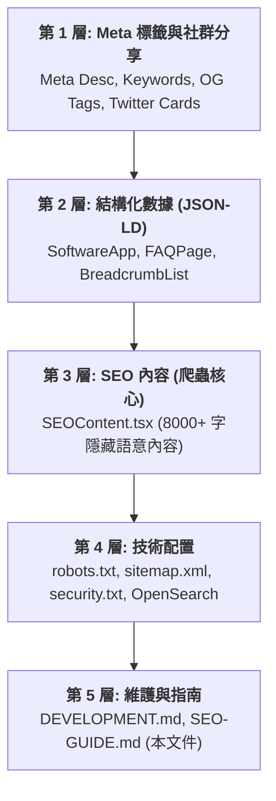

# 🎯  Mark It Live - SEO 核心與維護指南

本指南旨在幫助開發者與專案維護者了解  Mark It Live 的 SEO 架構、優化策略、日常維護檢查清單以及故障排除方法。

---

## 📌 概述 (Overview)

 Mark It Live 專案已實施**企業級的 SEO 優化**，旨在提升在 Google 搜尋引擎中的內容品質評分與點擊率。所有優化均遵循 Google 搜尋中心與 Schema.org 的最佳實踐，確保單頁應用程式 (SPA) 在完全由客戶端渲染的情況下，也能獲得卓越的爬蟲索引效果。

### 核心目標
*   **提升點擊率 (CTR)**：透過 Rich Snippet (豐富網頁摘要) 讓搜尋結果在 SERP 中更具吸引力。
*   **優化爬蟲發現**：為搜尋引擎提供豐富的語義化文本，彌補 SPA 動態渲染的爬取不足。
*   **建立搜尋信任**：透過 `security.txt` 與正確的 Meta 配置，向搜尋引擎與用戶展現專案的專業與合規性。

---

## 🏗️ SEO 五層架構 (5-Layer Architecture)

優化工作分為五個層次，確保從基礎標籤到日常維護無死角覆蓋：



---

## 🚀 核心優化策略與實施內容

### 1. 增強元標籤 (Meta Tags)
*   **Description**: 控制在 150-160 字符，精準覆蓋關鍵功能（Mermaid, LaTeX, PDF 導出）。
*   **Keywords**: 覆蓋 12+ 組核心關鍵字，包含繁、簡、中、英雙語導向。
*   **Robots & Canonical**: 明確索引指令與標準網址，防止因 GitHub Pages 等多網址部署造成的重複內容降權。

### 2. 結構化數據 (Schema.org JSON-LD)
我們在 `index.html` 中注入了三種核心 Schema，以觸發豐富網頁摘要：
*   **SoftwareApplication**: 完整描述應用功能、版本、運行要求與圖片。
*   **FAQPage**: 包含 8 個關於隱私安全、導出格式等常見問題的問答，增加搜尋結果在 SERP 中的佔比。
*   **BreadcrumbList**: 提供明確的導航層級結構。

### 3. SEO 友善內容 (SEO Friendly Content)
由於 React 應用主要由 JS 在客戶端動態渲染，我們建立了 [SEOContent.tsx](../src/components/markdown/SEOContent.tsx) 組件：
*   **8,000+ 字豐富內容**：詳細描述專案的 20+ 個主題與核心功能。
*   **語義化 HTML**：使用正確的 `<h1>` 到 `<h3>`、`<ul>`、`<li>`，使爬蟲能輕鬆抓取文字脈絡。
*   **sr-only 技術**：透過 CSS 樣式使該內容對一般視覺用戶隱藏，但對 Googlebot 與螢幕閱讀器完全開放，從而極大補足了 SPA 靜態文本不足的問題。

### 4. 其他技術配置
*   **robots.txt**: 優化爬蟲規則，屏蔽無效路徑，優先導引 Googlebot。
*   **sitemap.xml**: 新增圖片訊息支持，並調整更新頻率為 `weekly`。
*   **OpenSearch**: 整合瀏覽器搜尋框，讓用戶能直接在瀏覽器網址列搜尋專案內容。
*   **security.txt**: 提升安全合規性，增加搜尋引擎的信任度評分。

---

## 📅 定期維護計劃 (Maintenance Schedule)

| 頻率 | 任務項目 | 執行步驟 |
| :--- | :--- | :--- |
| **每週 (Weekly)** | 監控搜尋效能 | 檢查 Google Search Console (GSC) 的「效能」報告，觀察展示量與 CTR 趨勢。 |
| **每月 (Monthly)** | 更新網站地圖 | 手動更新 `public/sitemap.xml` 中的 `<lastmod>` 日期，向 Google 發出內容新鮮度信號。 |
| **每季 (Quarterly)** | 驗證結構化數據 | 使用 [Rich Result Tester](https://richresults.withgoogle.com/) 驗證 Schema 是否依然有效無語法錯誤。 |
| **每年 (Yearly)** | 更新安全合規 | 更新 `public/.well-known/security.txt` 中的 `Expires` 到期日，確保其隨時處於有效期內。 |

---

## ✅ 完整檢查清單 (Master Checklist)

### 1. 部署前快速檢查 (5 分鐘)
- [ ] 執行 `npm run build` 確保無任何編譯與打包錯誤。
- [ ] 執行 `npm run preview` 本地預覽確認 `head` 中的 Meta 標籤與靜態 HTML 中已成功渲染。
- [ ] 確認 `public/robots.txt` 與 `public/sitemap.xml` 已更新且路徑無誤。

### 2. Google Search Console (GSC) 登錄
- [ ] 提交 Sitemap 文件（`https://[your-domain]/sitemap.xml`）。
- [ ] 執行「URL 檢查」並對主頁點擊「要求建立索引」以加速爬蟲抓取。
- [ ] 在「增強內容」報告中驗證 `FAQ` 與 `SoftwareApplication` 結構化數據已被成功識別且無警告。

### 3. 功能更新時的 SEO 同步
若後續新增了重大功能（如新的圖表類型或自訂 Remark 插件），請務必同步更新以下內容：
- [ ] `index.html` 的 `SoftwareApplication` 內的 `featureList` 屬性。
- [ ] `index.html` 的 `FAQPage` (視情況增加對應的問答)。
- [ ] `src/components/SEOContent.tsx` 的對應章節描述，保持 8,000+ 字內容的新鮮度。

---

## 🔧 疑難排解 (Troubleshooting)

### Q1: Google Search Console 顯示「未檢測到結構化數據」
*   **原因**：JSON-LD 格式語法錯誤（例如遺漏逗號、引號未閉合），或腳本被內容安全策略 (CSP) 屏蔽。
*   **解決**：將 `index.html` 中的 JSON-LD 程式碼複製到 [Schema.org Validator](https://validator.schema.org/) 驗證語法，修正語法錯誤。

### Q2: 內容已在線上更新，但 Google 搜尋結果仍顯示舊版本
*   **原因**：瀏覽器快取或 Googlebot 未及時重新抓取您的網站。
*   **解決**：在 GSC 中對該 URL 重新執行「要求建立索引」，並確認 `sitemap.xml` 中的 `<lastmod>` 標籤已更新為最新建置日期。

### Q3: SEOContent 隱藏文本在網頁畫面上肉眼可見
*   **原因**：`src/index.css` 中的 `.sr-only` 樣式未正確加載、遺失或被其他 CSS 框架樣式覆蓋。
*   **解決**：檢查 `.sr-only` 樣式是否包含以下完整屬性以實現 100% 視覺隱藏但保留語義：
    ```css
    .sr-only {
      position: absolute;
      width: 1px;
      height: 1px;
      padding: 0;
      margin: -1px;
      overflow: hidden;
      clip: rect(0, 0, 0, 0);
      white-space: nowrap;
      border: 0;
    }
    ```
