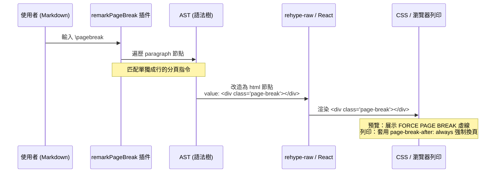

# 🖨️ 列印預覽、強制分頁與 PDF 合併指南 (Print & PDF Guide)

本文件詳細說明 Markdown Live Previewer 的物理列印、強制分頁、多文件合併下載/列印，以及客戶端 PDF 合併工具的實作機制與維護說明。

---

## 💻 1. 瀏覽器物理列印機制 (Browser Print Mechanism)

本專案摒棄了昂貴且有隱私疑慮的後端伺服器 PDF 渲染方案，採用 **100% 客戶端瀏覽器列印 (`window.print()`)** 機制來生成高品質的 PDF。

### 🎨 CSS `@media print` 樣式控制
當用戶點擊「列印 / PDF」按鈕時，系統會調用瀏覽器的列印引擎，並自動注入專屬的 `@media print` 樣式：
*   **版面淨化**：自動隱藏左側 CodeMirror 編輯器、頂部 Header、側邊導航欄、操作按鈕及對話框（`display: none !important`），僅保留右側的 Markdown 預覽區域。
*   **紙張與邊距自適應**：透過 `@page` 樣式動態注入用戶在設定中選擇的紙張大小（A4, A3, Letter）與方向（縱向/橫向），確保輸出版面精準。

### ✂️ 程式碼防截斷機制 (Anti-Truncation)
在一般螢幕顯示中，長行程式碼通常使用橫向滾動條展示。但在紙張列印時，這會導致超出邊界的部分被直接截斷遺失。
*   **實作原理**：在列印樣式中，我們對 `<pre>` 與 `<code>` 區塊強制套用了自動換行屬性：
    ```css
    @media print {
      pre, code {
        white-space: pre-wrap !important;
        word-wrap: break-word !important;
        word-break: break-all !important;
        overflow: visible !important;
      }
    }
    ```
    這能確保所有長程式碼在抵達紙張右側邊界時會自動換行，100% 避免列印資訊截斷。

---

## 📂 2. 多文件合併下載與合併列印 (Merge Export)

當用戶啟用「資料夾模式」時，專案支援將資料夾內的所有 Markdown 文件一次性合併匯出：

### A. Markdown 合併下載 (Merge Markdown)
*   **實作路徑**：`App.tsx` 中的 `downloadMarkdown` 函式。
*   **運作邏輯**：系統會自動抓取當前資料夾下的所有 `.md` 檔案，並以 `---`（Markdown 分割線）將其拼接在一起，組合成一個大型的單一 Markdown 檔案供用戶下載。

### B. 多文件合併列印 (Merge PDF)
*   **實作路徑**：`PreviewPanel.tsx`。
*   **運作邏輯**：
    1. 當開啟「合併列印」開關時，預覽區域會同時循環渲染資料夾內所有 Markdown 文件的渲染元件。
    2. 調用 `window.print()` 時，瀏覽器會將畫面上渲染出的所有文件「紙張」視為一個連續的長頁面，一次性列印成一份包含多個文件的完整 PDF。

---

## ⚡ 3. AST 驅動的強制分頁機制 (Page Break)

為了能精準控制 PDF 章節的起始位置，專案支援手動強制換頁功能。

### 📝 分頁指令與語法
用戶可在 Markdown 原始碼中單獨起一行，輸入以下三種指令之一（前後可包含空白，但該行不能有其他文字）：
*   `\pagebreak` (推薦，仿 LaTeX 語法)
*   `[page-break]`
*   `---pb---`

### 🔧 運作原理與 AST 插件化
本功能已完全重構為 **AST 插件驅動**，杜絕了舊版本在程式碼區塊內「誤殺」的 Bug。



1.  **AST 解析**：自訂插件 `remarkPageBreak` 在編譯階段遍歷所有段落。當發現段落內僅含有一個 text 節點且內容匹配分頁指令時，會將該段落節點就地改造成一個 `html` 節點，其值為 `<div class="page-break"></div>`，並刪除其所有子節點。
2.  **HTML 渲染**：`rehype-raw` 與 `react-markdown` 將該 html 節點編譯為真正的 DOM 元素。
3.  **預覽與列印樣式雙效表現**：
    *   **預覽模式**：畫面上會呈現一條帶有 **"FORCE PAGE BREAK"** 標籤的虛線，引導用戶排版。
    *   **列印模式**：虛線被隱藏，並透過 CSS 觸發物理分頁：
        ```css
        @media print {
          .page-break {
            page-break-after: always;
            break-after: page;
            height: 0;
            margin: 0;
            padding: 0;
            border: none;
          }
        }
        ```

---

## 🛠️ 4. 外部 PDF/圖片客戶端合併工具 (PDF Merge Tool)

專案在「工具箱」中提供了完全運行在瀏覽器端的 **PDF 合併工具**。

*   **組件路徑**：`src/components/modals/DataMediaCenterTool.tsx` (或 `PdfMergeTool.tsx`，視具體架構而定，可直接使用 `PdfMergeTool` 元件)。
*   **核心技術**：基於 `pdf-lib` 庫。
*   **運作機制**：
    1. **二進位讀取**：用戶上傳外部 PDF 或圖片檔案（PNG, JPG），系統以 `ArrayBuffer` 讀入記憶體。
    2. **拖曳排序**：利用 React 狀態維護檔案陣列，支援滑鼠拖曳調整合併順序。
    3. **圖片等比縮放與 PDF 封裝**：對於上傳的圖片，系統會自動在記憶體中建立一個 A4 尺寸的空白 PDF 頁面，計算圖片的寬高比，將其**等比縮放**並居中繪製在該 PDF 頁面上。
    4. **客戶端合併**：透過 `pdf-lib` 的 `PDFDocument.create()` 建立新文檔，依次拷貝並合併所有 PDF 頁面，最後就地編碼為二進位 Blob 流，提供下載。整個過程 100% 在本地瀏覽器內完成。
