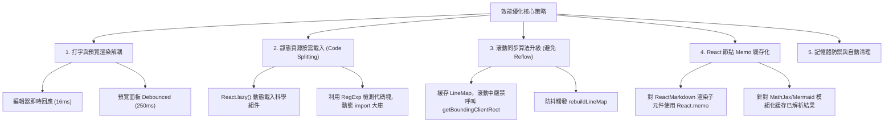

# ⚡ 效能優化目標與技術指南 (Performance Optimization Goals)

在 100% 瀏覽器端（Client-side/Serverless）的架構下，Markdown Live Previewer 的效能直接決定了使用者的核心體驗。為了讓使用者在編輯超長文檔或插入大量科學圖表時依然能享受「絲滑般流暢」的編輯與預覽，我們制定了本份效能優化指南。

本文件旨在評估當前系統的效能瓶頸，制定出可量化的關鍵效能指標（KPI），並提供具體的優化技術路線圖。

---

## 🔍 1. 當前效能現況與瓶頸分析 (Current Bottlenecks)

經評估，目前架構在處理複雜或大型 Markdown 文件時，存在以下四個主要效能瓶頸：

### 🛑 瓶頸 A：打字輸入與預覽渲染同步阻塞 (Input & Render Coupling)
當前編輯器（CodeMirror）打字時，會立即觸發 `updateCurrentDocument` 更新 React 全局 State。
這導致：
1. 每敲擊一次鍵盤，整個 React 樹與 `react-markdown` 就會立即執行一次 Unified / Remark / Rehype 的 AST（抽象語法樹）完整編譯。
2. 科學公式（MathJax）與圖表元件會在主執行緒（Main Thread）中同步執行解析，造成嚴重的**輸入卡頓（Input Lag）**。
3. **長期任務（Long Tasks > 50ms）** 頻繁出現，瀏覽器無法及時響應鍵盤事件。

### 🛑 瓶頸 B：巨大靜態資源包一次性加載 (Heavy Initial Bundle)
從 `package.json` 可以發現，專案依賴了許多龐大的科學與圖形庫：
* `mermaid` (~1.5MB+)
* `vega` & `vega-lite` & `vega-embed` (~1.2MB+)
* `abcjs` (樂譜解析, ~400KB)
* `pdf-lib` (PDF 處理, ~500KB)

目前這些大庫皆在 `App.tsx` 中被直接 `import`。這導致初始打包的 `index.js` 體積過於龐大，在常規 3G 網路或低階設備上會造成顯著的 **FCP（首次內容繪製）** 與 **LCP（最大內容繪製）** 延遲，影響首網頁載入體驗。

### 🛑 瓶頸 C：滾動同步頻繁觸發瀏覽器排版重繪 (Layout Thrashing in ScrollSync)
雙向滾動同步機制（ScrollSync）在每次滾動或內容更新時，會呼叫 `rebuildLineMap` 遍歷所有帶有 `[data-line]` 屬性的 DOM 元素，並執行 `getBoundingClientRect()`。
* **Layout Thrashing**：在快速滾動時，無數次調用讀取 layout 屬性會強制瀏覽器進行即時的排版重繪（Reflow/Repaint），導致滾動畫面卡頓、掉幀（低於 30 FPS）。

### 🛑 瓶頸 D：圖表與多媒體渲染缺乏防禦性清理 (Memory Leaks)
當切換文檔或大幅修改圖表（Mermaid, Vega, SMILES, ABCJS）時，舊的圖表實例與產生的 DOM 節點、事件監聽如果沒有及時卸載（Unmount）與清理，會在瀏覽器內存中持續堆積，導致長時間使用後網頁佔用過多記憶體（Memory Leak），最終使頁面崩潰。

---

## 🎯 2. 可量化的效能指標 (Quantifiable KPIs)

我們將效能優化目標具體量化為以下指標，作為後續優化成果的檢驗標準：

| 指標類別 | 效能維度 | 當前預估值 | 優化目標值 (KPI) | 檢驗工具/方法 |
| :--- | :--- | :--- | :--- | :--- |
| **打字體驗** | 鍵盤輸入延遲 (INP) | ~80ms - 150ms | **< 16ms (60 FPS)** | Chrome DevTools Performance |
| **預覽更新** | 預覽渲染更新延遲 | 0ms (即時同步) | **打字暫停後 250ms - 300ms** | 使用防抖（Debounce）控制 |
| **首屏加載** | First Contentful Paint (FCP) | ~3.8s (中等網路) | **< 1.5s** | Lighthouse / Web Vitals |
| **首屏加載** | Largest Contentful Paint (LCP) | ~5.2s (中等網路) | **< 2.5s** | Lighthouse / Web Vitals |
| **資源大小** | 主 Entry Bundle 大小 (Gzipped) | ~2.5MB | **< 250KB** | Vite Bundle Visualizer |
| **滾動體驗** | 雙向滾動同步影格率 | ~25 FPS | **> 55 FPS (絲滑滾動)** | Chrome Rendering Frame Rate |
| **記憶體控制**| 閒置記憶體佔用 | 隨時間線性上升 | **穩定維持，切換文件後釋放** | Chrome Memory Profile |

---

## 🛠️ 3. 核心優化策略與技術方案 (Optimization Strategies)

為了達成上述 KPI，我們規劃了五大優化技術方案：



### 💡 方案一：輸入與渲染解耦 —— 防抖預覽 (Debounced Preview Render)
*   **作法**：
    1. 在 `App.tsx` 中，將編輯器的 `code` 狀態與預覽面板的 `previewCode` 狀態分離。
    2. 編輯器使用即時的本地 State，確保 CodeMirror 的光標與文字反射在 **16ms** 內完成，維持極致的流暢打字感。
    3. 使用 React 的 `useDeferredValue` 或自訂的 `useDebounce` 限制 `previewCode` 的更新頻率（例如防抖 250ms - 300ms）。
    4. 只有在使用者停頓打字時，預覽面板才會收到新的內容並執行重渲染，徹底解決每次按鍵主執行緒被 AST 解析霸佔的問題。

### 💡 方案二：大資源按需加載與代碼分割 (Dynamic Code Splitting)
*   **作法**：
    1. 將預覽面板內部的科學渲染器重構為動態加載的獨立元件：
       - `DiagramBlock.tsx` (Mermaid)
       - `MathBlock.tsx` (MathJax)
       - `VegaBlock.tsx` (Vega-Lite)
       - `AbcBlock.tsx` (ABCJS)
    2. 使用 `React.lazy()` 與 `Suspense` 包裹這些組件。
    3. **正則掃描載入**：在預覽面板解析前，先以極快的輕量正則表達式快速檢索 raw markdown 是否包含 ` ```mermaid `、`$$`、` ```vega ` 或 ` ```abc ` 語法。
    4. 只有在偵測到對應語法時，才觸發 Dynamic Import（例如 `const mermaid = await import('mermaid')`）載入該大庫。未用到該功能的用戶，首網頁載入時 **0%** 載入這些龐大的 JS 資源，將主 bundle控制在 250KB 以內。

### 💡 方案三：極速滾動同步 —— 避免 Layout Thrashing
*   **作法**：
    1. **高度快取（Caching Offset Table）**：將 `rebuildLineMap` 的觸發頻率降至最低。只有在預覽內容渲染完畢（如 MathJax、Mermaid 異步完成並發出 `preview-content-height-change` 事件）或視窗 Resize 時，才進行一次性測量並將行號高度快取在 Map 中。
    2. **嚴禁滾動中讀取 Layout**：在 ScrollSync 的滾動事件監聽（如 `handleEditorScroll` 與 `handlePreviewScroll`）中，**全面移除**對 `getBoundingClientRect()` 或 `scrollHeight` / `clientHeight` 等觸發瀏覽器 Reflow 屬性的讀取。
    3. **數學插值法**：滾動時直接從快取好的 `lineMap` 中讀取最鄰近的行號高度，使用線性插值快速估計對應的滾動百分比，確保滾動同步幀率達到穩定的 **60 FPS**。

### 💡 方案四：React 節點 Memo 緩存化 (Memoization)
*   **作法**：
    1. 對 `react-markdown` 內部的自訂組件（如 `code` 渲染器、GitHub Alerts 警示盒、WikiLink 組件等）使用 `React.memo` 進行包裹。
    2. 使用 `useMemo` 緩存自訂 AST 插件（如 `remarkGithubAlerts`、`remarkWikiLink`）的實例，防止 React 重渲染時重複建立插件，造成垃圾回收（Garbage Collection）頻繁觸發的 CPU 抖動。
    3. 對於已經渲染完成的 Mermaid 圖表或 MathJax 公式，以其源代碼的 **Hash 值**（如 `hashString(code)`）作為 Key 進行 React 緩存。當原始碼未變更時，直接返回已渲染的 DOM 結構，避免昂貴的重複渲染。

### 💡 方案五：記憶體防禦與自動清理 (GC Optimization)
*   **作法**：
    1. 在 `DiagramBlock`、`AbcBlock` 等元件的 `useEffect` 清理函數（Cleanup function）中，明確執行對應庫的銷毀方法（例如 Mermaid 的銷毀 API、清理 Canvas 快取、卸載全域事件監聽）。
    2. 限制單次編輯器歷史記錄（Undo/Redo Stack）的最大容量，避免長時間編輯超大文件時歷史堆疊無限膨脹，吞噬記憶體。
    3. 實作平滑遷移：當 localStorage 容量（目前上限 5MB）使用率超過 80% 時，主動引導使用者切換至 IndexedDB 儲存方案，或提供快速的一鍵打包導出備份。

---

## 📈 4. 實施優先級與路線圖 (Implementation Roadmap)

為確保專案高效迭代，優化工作將分為三個階段逐步實施：

### 🥇 第一階段：核心體驗提升 (High Priority / High ROI)
*   **目標**：解決打字卡頓與滾動掉幀。
*   **項目**：
    1. 實作「輸入與預覽渲染解耦」（方案一：防抖預覽），直接消除打字卡頓。
    2. 優化 `rebuildLineMap`（方案三：避免 Layout Thrashing），快取高度數值，解耦滾動中的 layout 讀取。
*   **預計效益**：打字流暢度提升至 60 FPS，滾動流暢度大幅改善。

### 🥈 第二階段：加載效能優化 (Medium Priority / High Complexity)
*   **目標**：降低 Initial Bundle 體積，提升網頁開啟速度。
*   **項目**：
    1. 實作「動態代碼分割與 Lazy Loading」（方案二），拆分 Mermaid、Vega、ABCJS、MathJax 等大型依賴庫。
    2. 對 ReactMarkdown 各渲染元件進行 `React.memo` 包裹與 Hash 快取（方案四）。
*   **預計效益**：首屏 LCP 縮短 50% 以上，主 JavaScript 包體積下降 80%。

### 🥉 第三階段：防禦性增強與深度功能 (Low Priority)
*   **目標**：提升系統長期運行的穩定性，防範容量上限。
*   **項目**：
    1. 檢視並修補各個科學組件的卸載清理邏輯（方案五），避免記憶體洩漏。
    2. 開發 IndexedDB 的平滑擴充方案，支持大容量文件管理。
*   **預計效益**：應用程序可在連續運行數小時、編輯數十個文件後，記憶體佔用依舊保持穩定。

---
*文件維護人：Antigravity (Senior Engineer Mode)*
