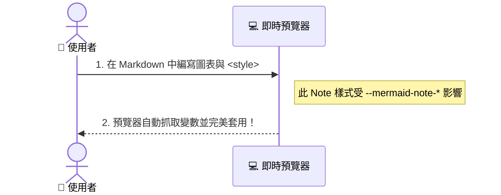

## 🧪色彩實驗室(β)
本預覽器深度整合了主題系統與 Mermaid 配色。您可以在 Markdown 文檔中直接內嵌 `

---

## 🎨 擴充警示框 (Github-style Alerts)
除了 GitHub 原生的 5 種基本警示框（Note、Tip、Important、Warning、Caution）之外，本編輯器額外支援了**擴充語義類型**、**自訂標題**與**空格容錯**功能。

### 1. 支援的類型：
*   **Info**：`[!note]`、`[!info]`
*   **Tip/Success**：`[!tip]`、`[!success]`、`[!check]`、`[!quickstart]`
*   **Warning**：`[!warning]`、`[!caution]`
*   **Danger**：`[!danger]`、`[!error]`、`[!bug]`、`[!failure]`
*   **Important**：`[!important]`、`[!question]`、`[!help]`、`[!faq]`
 
> [!TIP]
> 支援:`開頭大寫`、`全大寫`、`全小寫` 的寫法

### 2. 自訂標題示範：
您可以透過 `[!TYPE] 自訂標題` 來替換預設的大寫標題字樣（亦支援如 `[!TYPE](自訂標題)` 的括號包裝）：

> [!NOTE](自訂標題)
> 這是一個自訂標題的範例。

### 3. 語法容錯（空格容錯）：
> [! WARNING ]
> 這是一個格式容錯測試，前後包含多餘空格也能正常匹配。

### 4. 巢狀結構:
> [!Question]
> 可以透過。
>> [!TIP]
>> 巢狀寫法來組合不同類型的警示框。
>>> [!danger]
>>> 但為了可讀性,還是希望不要用到這麼多層。